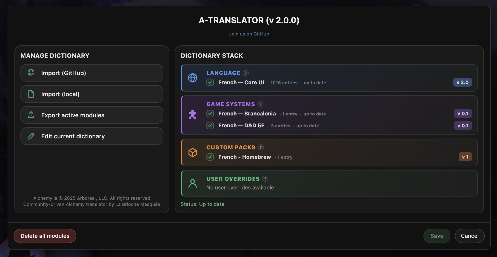
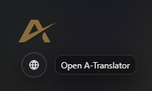

# A-Translator v 2.0.0

Ferramenta de localização não oficial para o _Alchemy VTT_.

A-Translator possibilita jogadores e mestres traduzirem a interface do _Alchemy VTT_ e terminologia de sistemas de jogo usando dicionários modulares guardados inteiramente em seus próprios computadores. Todas as traduções são aplicadas localmente no navegador. Nenhuma informação é enviado para outro lugar.



---

# O que é A-Translator?

A-Translator é um _Tampermonkey userscript_ que traduz a interface do _Alchemy VTT_ usando dicionários mantidos pela comunidade.

Versão 2 introduz uma arquitetura modular onde múltiplos dicionários podem coexistir:
- Core UI dictionaries (Dicionários da Interface principal)
- System dictionaries (Dicionários de sistemas)
- Custom dictionaries (Dicionários personalizados)
- User overrides (Substituições do usuário)

---

# O que A-Translator não é

A-Translator:

- Não é uma funcionalidade oficial do Alchemy
- Não é afiliada com o Arboreal, LLC
- Não modifica os servidores Alchemy
- Não modifica ou desbloqueia conteúdos de jogo
- Não acessa os dados de sua conta
- Não envia dados para qualquer outro lugar

---

# Instalação

## 1. Instale Tampermonkey

https://www.tampermonkey.net/

## 2. Configure Tampermonkey

Configurações recomendadas:
- Ative o Modo Desenvolvedor
- Ative Scripts de Usuário
- Habilite acesso a arquivos de URLs
- Habilite scripts na navegação privada/incógnita do windows

## 3. Instale A-Translator

Obtenha o arquivo abaixo, abra-o em qualquer programa de edição de texto e copie o seu conteúdo:

https://raw.githubusercontent.com/BriocheMasquee/a-translator/main/userscript/a-translator.user.js 

Ou então acesse este link e copie o seu conteúdo:

https://github.com/BriocheMasquee/a-translator/blob/main/userscript/a-translator.user.js

Clique na extensão do Tampermonkey, clique em "Add new script..." e substitua o conteúdo pelo o que foi copiado acima. Então vá na aba file e então save (ou pressione ctrl + s).

Futuras atualizações do script são feitas automaticamente.

---

# Uso

Abra https://app.alchemyrpg.com 

Abaixo do logotipo no parte superior esquerda da página você conseguirá ver um ícone de um globo para abrir o A-Translator, clique nele (caso não o encontre, por favor, recarregue a página).



Você pode:
- Import local dictionaries (Importar de dicionários locais)
- Import GitHub dictionaries (Importar de dicionários do GitHub)
- Enable or disable modules (Habilitar ou desabilitar módulos)
- Export active modules (Exportar módulos ativos)
- Edit personal overrides (Editar substituições pessoais)
- Update installed dictionaries (Atualizar dicionários instalados)

---

# Tipos de Dicionário

| Tipo | Propósito |
|--------|----------|
| core | Tradução da interface do Alchemy |
| system | Terminologias do sistema de jogo |
| custom | Extensões da comunidade opcionais |
| user | Substituições pessoais |

Múltiplos dicionários de sistema podem coexistir simultaneamente. Substituições pessoais do usuário sempre terão prioridade.

---

# Formato do Dicionário

```json
{
  "meta": {
      "id": "fr-core",
      "name": "French UI",
      "lang": "fr",
      "type": "core", // tipos suportados : core, system, custom, user
      "dictVersion": "2.0"
  },
  "entries": {
      "game": "Partie",
      "character": "Personnage"
  }
}
``` 

---

# Dicionários do GitHub

Dicionários oficiais podem ser distribuídos através do GitHub.

A-Translator pode:
- Achar os dicionários disponíveis
- Importar dicionários diretamente do GitHub
- Detectar atualizações
- Atualizar módulos individuais

---

# Migração da Versão 1

Instalações existentes da Versão 1 são migradas automaticamente. Nenhuma conversão manual é necessária.

---

# Contribuições da Comunidade

Contribuições da comunidade são bem-vindas.

Você pode contribuir com:
- Core UI translations (Traduções da Interface principal)
- System dictionaries (Dicionários de sistema)
- Translation improvements (Melhorias nas traduções)
- Documentation (Documentação)

Repositório: https://github.com/BriocheMasquee/a-translator 

---

# Resetar

Apagar todos os módulos (botão "Delete all modules") remove:

- Dicionários instalados
- Substituições do usuário
- Configurações de tradução

O userscript em si permanece instaldo.

---

# Isenção de responsabilidade

_Alchemy_ é do © _Arboreal, LLC_.

A-Translator é um projeto comunitário não oficial e não é afiliado ao _Arboreal, LLC_.

---

# Licença

MIT License
