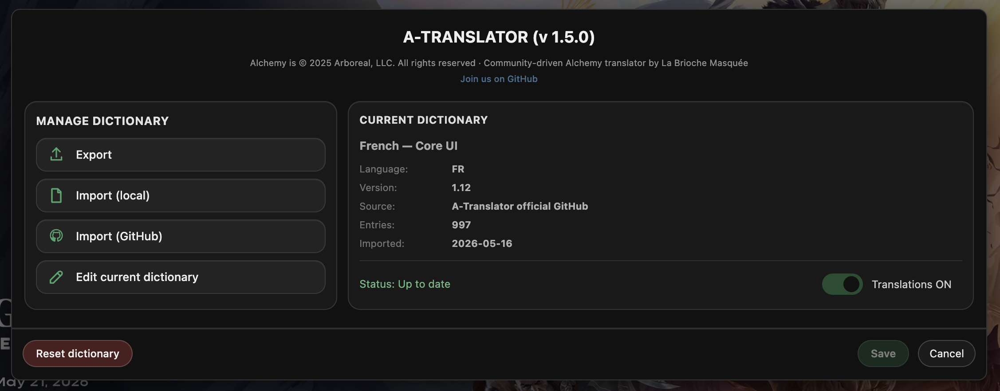

# A-Translator

Unofficial UI translation tool for **Alchemy VTT**, based on community dictionaries and local customization.

A-Translator allows you to translate Alchemy’s interface locally using editable dictionaries, without modifying the platform, game data, or Alchemy servers.

## What is A-Translator?

A-Translator is a **Tampermonkey userscript** that:
- Translates Alchemy VTT’s interface text
- Uses editable community dictionaries
- Supports local and GitHub-hosted dictionaries
- Applies translations dynamically as the UI updates
- Lets you enable or disable translations at any time
- Stores all data locally in your browser

No data is sent anywhere.



---

## What A-Translator is NOT

- Not an official Alchemy feature
- Not affiliated with Arboreal, LLC
- Not a machine translation tool
- Not modifying Alchemy servers or game content

A-Translator is a **client-side localization and accessibility helper**.

---

# Installation

## 1. Install Tampermonkey

### Chrome / Edge / Brave
https://www.tampermonkey.net/

### Firefox
https://www.tampermonkey.net/

---

## 2. Configure Tampermonkey (IMPORTANT)

Before installing A-Translator, make sure Tampermonkey is correctly configured.

Open:

```txt
Tampermonkey Dashboard → Settings
```

Recommended settings:
- Enable **Developer mode**
- Enable **Allow User Scripts**
- Enable **Allow access to file URLs** (recommended)
- Enable **Allow scripts in private / incognito windows**

If these options are disabled, the script may install correctly but will not run properly.

---

## 3. Install A-Translator

Open the userscript URL below and confirm installation in Tampermonkey:

```txt
https://raw.githubusercontent.com/BriocheMasquee/a-translator/main/userscript/a-translator.user.js
```

Tampermonkey will automatically manage future script updates.

---

# Usage

- Open:

```txt
https://app.alchemyrpg.com/
```

- A floating A-Translator button appears on the left side of the screen
- Click it to open the A-Translator panel

You can then:
- Import an official GitHub dictionary
- Import a local JSON dictionary
- Export your current dictionary
- Edit your current dictionary manually
- Enable or disable translations at any time

Dictionary editing is hidden by default.

Click:

```txt
Edit current dictionary
```

to open the dictionary editor.

Press:

```txt
Save
```

to apply changes immediately.

You may need to reload the page once after the very first installation.

---

# Dictionaries

A-Translator supports:
- Local dictionaries
- Official GitHub-hosted dictionaries
- Community-made dictionaries

## Dictionary format

Dictionaries use the following structure:

```json
{
  "meta": {
    "lang": "fr",
    "dictVersion": "1.2",
    "scriptVersion": "1.2.0"
  },
  "entries": {
    "game": "Partie",
    "character": "Personnage"
  }
}
```

### Meta fields

| Field | Description |
|---|---|
| `lang` | Language code (`fr`, `es`, `de`, etc.) |
| `dictVersion` | Dictionary version |
| `scriptVersion` | A-Translator version used during export |

Additional metadata may be stored locally after GitHub imports:
- dictionary id
- display name
- source information
- import date
- update information

---

## Official dictionary manifest

Official dictionaries are listed in:

```txt
dictionaries/manifest.json
```

The manifest provides:
- dictionary id
- display name
- language
- version
- description
- download URL

A-Translator uses this manifest to:
- display available dictionaries
- import official dictionaries
- check whether updates are available

---

## Current dictionary card

The **Current dictionary** panel displays:
- Dictionary name
- Language
- Version
- Source
- Entry count
- Import date
- Update status

Possible status values:
- `Up to date`
- `Update available`
- `Checking…`
- `Local dictionary`
- `Check failed`

When an update is available, an **Update** button appears automatically.

---

## Community contributions

If you create or improve a dictionary for another language, feel free to contribute it to the repository.

Community contributions are welcome.

Repository:
```txt
https://github.com/BriocheMasquee/a-translator
```

---

# Reset / Uninstall

## Reset dictionary

The **Reset dictionary** button removes:
- the current local dictionary
- dictionary metadata
- local translation settings

It does **not** uninstall the userscript itself.

---

## Fully uninstall A-Translator

To completely remove A-Translator:

1. Open the Tampermonkey dashboard
2. Disable or remove the A-Translator userscript
3. Optionally use **Reset dictionary** beforehand to clear local data

---

# Disclaimer

*Alchemy* is © Arboreal, LLC.

A-Translator is an unofficial community project and is not affiliated with Arboreal, LLC.

Use at your own discretion.

---

# License

MIT License- Edit your dictionary.
- Save → translations apply<br>
***Note:** You may need to reload the page once after the first installation.*

You can:
- Export / import dictionaries (JSON)
- Merge or replace dictionaries
- Disable translations at any time

## Dictionaries
This repository includes:
- A **base French dictionary** ready to import  
  → `dictionaries/fr-dict-v1.json`
- A **blank dictionary template**  
  → `dictionaries/template-dict-v1.json`

Both files can be imported directly from the A-Translator interface.

### Dictionary metadata
Dictionaries use a structured format with a `meta` section and an `entries` section.

The `meta` block stores non-editable information used by A-Translator:
- `lang` — language code of the dictionary (e.g. `fr`, `en`)
- `dictVersion` — dictionary version number
- `scriptVersion` — A-Translator script version used to generate the file

This metadata is:
- automatically included on export,
- displayed read-only in the editor,
- preserved and merged on import,
- fully backward-compatible with older dictionary files.

### Community contributions
If you create a dictionary for another language, feel free to share it.  
I’m happy to host community-made dictionaries in this repository so others can benefit from them.

## Uninstall
Before uninstalling, **disable the A-Translator script in Tampermonkey**.

Then:
- Open the A-Translator panel
- Click the **Uninstall** button

This removes the UI, loader, script, and local dictionary from your browser.<br>
You can re-enable or remove the Tampermonkey script afterwards if needed.

## Disclaimer
*Alchemy* is © Arboreal, LLC.  
A-Translator is an **unofficial community tool** and is not affiliated with Arboreal, LLC.
Use at your own discretion.

## License
MIT License
